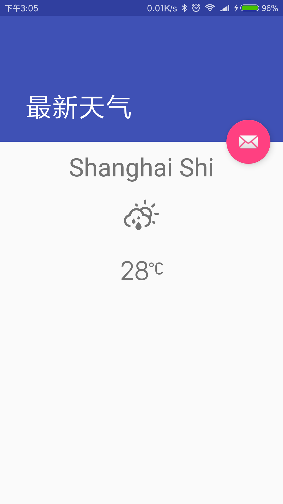
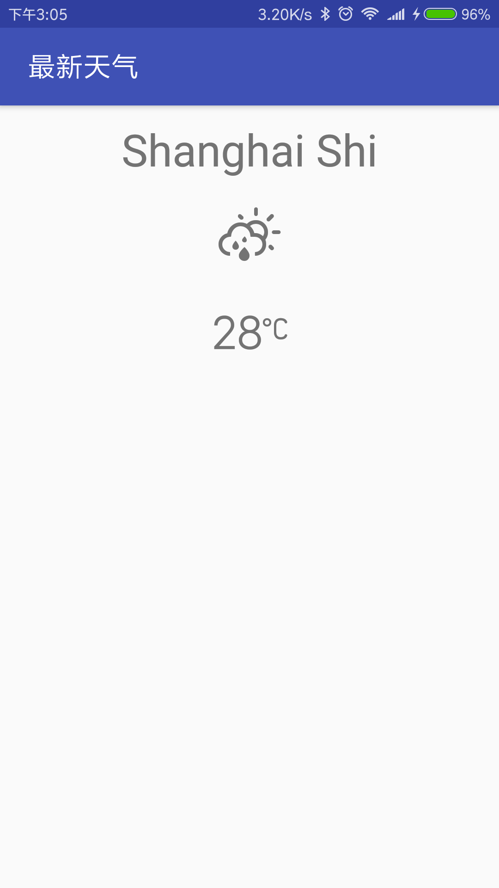

# KotlinWeather

基于https://github.com/JakeLin/SwiftWeather 的原型图的Kotlin版本

这是基于[openweathermap](http://openweathermap.org)提供的Api的天气项目，
项目使用[Kotlin](https://kotlinlang.org)作为主要开发语言，
采用[Databinding](https://developer.android.com/topic/libraries/data-binding/index.html)+
[RxJava](https://github.com/ReactiveX/RxJava) + 
[Retrofit](https://github.com/square/retrofit)的MVVM作为架构模式。

# 预览

# Todo
-[x] 天气获取
-[x] 当前天气显示
-[ ] 分时天气显示 
